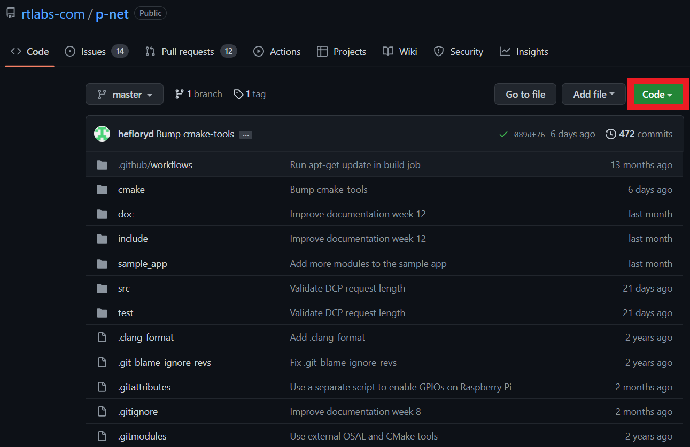
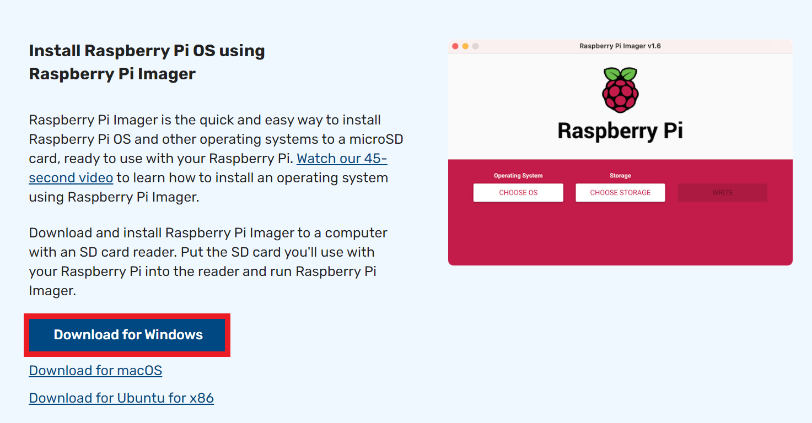
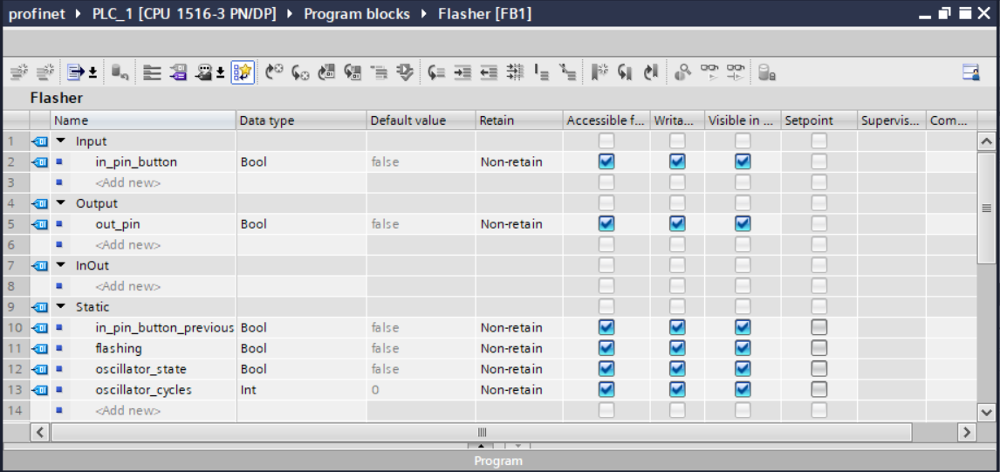
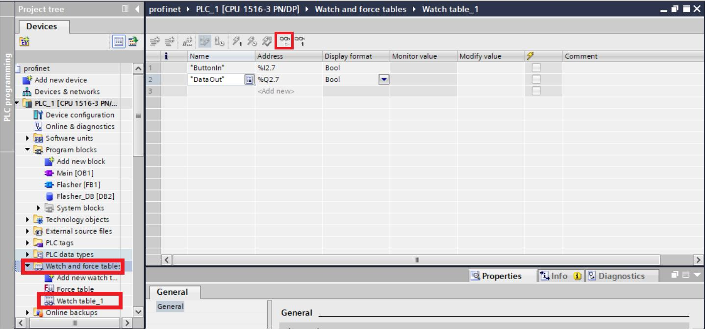

# iProfiApp

> inexpensive Profinet Application
> 

# **Introduction**


In order to test the communication through Profinet we used a sample application created by rt-labs to send logic signals of 1 or 0 to a PLC (IO controller) from a raspberry pi model B+ (IO device).

### Topics

- rt-labs repository download
- Raspberry pi set up
- Download and compile p-net
- Run the sample application
- Set up the PLC
- Simulation files

**[This tutorial was tested with a raspberry pi model B+, a S71500(CPU 1516-3 PN/DP), the rt-labs GitHub repository was totally functional on 27/06/2022 and TIA Portal was at v16.]**

RT-LABS repository download

Further on in this repository the existing files in the rt-labs repository will be needed where the GSDML files and the files attached to the IO device in the TIA Portal are present. You can download it with the link below:

```html
[https://github.com/rtlabs-com/p-net](https://github.com/rtlabs-com/p-net)
```

Click on the button “Code”.



Figure 1 - rtlabs-com GitHub repository.

Click on the button “Download ZIP”.


Figure 2 - Repository download.

Now extract the .zip files to your desired location, when you need these files it will be explained in the tutorial.

## Raspberry pi set up

### Imager download

First of all we will need to install Raspberry Pi OS image to SD card using Raspberry Pi Imager.

You can install it with the link below:

```html
https://www.raspberrypi.com/software/](https://www.raspberrypi.com/software/) 
```

Click on the Download for Windows button.



Figure 3 - Installing Raspberry Pi OS using Raspberry Pi Imager. 

Open the downloaded file.


Figure 4 - Choose OS.

Click on the CHOOSE OS option then choose the recommended option which is the full version.


Figure 5 - Choose Storage.

Click on the CHOOSE STORAGE option and select your SD card (8 GB minimum storage). Then click the WRITE button to finish the installation on the SD card.

## Raspberry pi set up

For an easier use of the raspberry pi it is advisable to use a mouse, keyboard and monitor. If you have already connected the raspberry pi to the network and defined its ip if you enable the VNC option by going to: Menu > Preferences > Raspberry Pi Configuration > Interfaces. You will be able to use your PC to access the raspberry pi by installing the respective VNC viewer on your PC (link below). With this you won't need to use a mouse, keyboard and monitor for the raspberry pi.

```html
[https://www.realvnc.com/pt/connect/download/viewer/](https://www.realvnc.com/pt/connect/download/viewer/) 
```

First we insert the SD card and do the login (choose any name and password you like), then we'll update the raspberry pi and install the latest version of **cmake.** To do this open the terminal and enter the following commands in command line:

```python
sudo apt update
sudo apt install snapd  
sudo reboot 
sudo snap install cmake --classic
```

Verify the installed version (at the time of the tutorial, we used version 3.19, but you should have version 3.14 or newer):

```python
cmake --version
```

You also need **Git** to download the github repository of p-net from rt-labs. Install it inserting the following commands to the command line:

```python
sudo apt install git
```

## Download and compile p-net

First we need to create a directory and to do it, use the following commands:

```python
mkdir /home/(user name)/profinet/
cd /home/(user name)/profinet/
```

Clone the GitHub repository:

```python
git clone --recurse-submodules https://github.com/rtlabs-com/p-net.git
```

This command will clone the repository with submodules.

after that, create and configure the build:

```cpp
cmake -B build -S p-net
```

Build the code:

```python
cmake --build build --target install
```

## Run the sample application

Run the sample app in the build directory:

```python
cd /home/(user name)/profinet/
cd build
```

Enable the Ethernet interface and set the initial IP address:

```python
sudo ifconfig eth0 192.168.228.146 netmask 255.255.255.0 up
```

Run the sample application:

```cpp
sudo ./pn_dev -v
```

The IP settings are stored to a file. If you accidentally have run the application when IP settings were wrong, use this command to remove the stored settings:

```python
sudo ./pn_dev -r
```

Now you have installed the sample app on the Raspberry Pi. In order to see it in action, you need to connect it to a PLC.

# Set up the PLC

For this tutorial was used a S71500(CPU 1516-3 PN/DP) PLC connected to a switch where the raspberry pi and the PC are also connected. It is recommended that the three devices are connected on the same network to avoid connection errors, such as failures in the delivery/return of the signal, between the PLC and the raspberry pi.

The next step will be using TIA Portal v16 to configure everything that is needed. To start click on the “Create new project” button, choose a name and select version v16.


Figure 6 - Create new project

Then click on “Configure a device”.


Figure 7 - Configure a device.

In the “Configure a device” menu choose the PLC that you will use. For the sake of this tutorial we used a S71500(CPU 1516-3 PN/DP) 6ES7 516-3AN02-0AB0.


Figure 8 - CPU 1516-3 PN/DP 6ES7 516-3AN02-0AB0.

Now head to “Network view”.


Figure 9 - Network view.

In order to choose the GSDML file, you must go to: Options > Manage general station description files (GSD).


Figure 10 - Choosing the GSDML file.

Now select the place where you extracted the repository and choose the sample app folder. After selecting, the GSDML files will be displayed in this menu. Select the necessary file and press install.


Figure 11 - GSDML file selection.

Now on the right side of the screen under “Hardware catalog”, in the search bar search for rt-labs and then choose “P-Net multi-module sample app”.


Figure 12 - Device catalog.

Now in the centre of the screen should appear the device as demonstrated in the image below.


Figure 13 - IO device.

The next step will be to connect the two devices as shown in the picture. To do that, just click and drag over the green square in the middle of the IO controller and the green square of the IO device.


Figure 14 - TIA portal connection between IO controller and IO device.

To set up both devices IP addresses, start with the PLC and then the IO device.  


Figure 15 - IO controller adress.


Figure 16 - IO device adress.

Double click on rt-labs-dev and the following window should appear. Inside that window, on the right hand side where it says “Hardware catalog”, you must drag the DIO 8xLogiclevel to the first slot below the X1 P1.


Figure 17 - Insertion of the modules.

Now by clicking on the IO device in IO cycle > update time, the option “calculate update time automatically” will be enabled by default, so you will need to change to “Set update time manually” and select the update time to 16 ms.


Figure 18 - Update time.

To know what values are being received in the PLC we must first see which adresses are used for the inputs and outputs.


Figure 19 - Adresses of the DIO module.

To know what values are being sent and received in the PLC we must identify the input and output tags as in the picture below, together with their data type and address:


Figure 20 - PLC tags.

It will be necessary to create a block in order to be able to see the values obtained, so it will be necessary to follow these steps for it to work correctly:


Figure 21 - Add new block.

You must use a Function Block with SCL as language.


Figure 22 - Function block.

Within the block we will have to introduce the variables that will act as inputs, outputs and others that need to be configured.



Figure 23 - Program block data.

With the block already created we will pull it into the main and then connect to the "in_pin_button" the "ButtonIn" and the "out_pin" the "DataOut".


Figure 24 - Pogram block in the main.

You must configure the watch table exactly as described in the figure. To be able to view it, you must press the button highlighted in the figure below.



Figure 25 - Watch table configuration. 

Before downloading the configuration to the PLC and pressing "Go online" you should compile the hardware by pressing the button "Hardware (rebuild all)" and also the software by pressing the button "Software (rebuild all)".


Figure 26 - Compile both hardware and software.

Now you should download the configuration to the PLC on the following button.


Figure 27 - Download to the PLC step.

Then press the “Go online” button and select your settings.


Figure 28 -  “Go Online” step.

When running, in order to study the values, connect to the PLC (“Online”). On the “Watch table_1” page, click the small “Monitor all” icon. The values on the page will be continuously updated.

## Simulation files

To see the value being sent by the IO device every 0.1 s, enter the following command into the raspberry pi:

```python
cd /home/(user name)/profinet/
cd build
watch -n 0.1 cat /home/(user name)/profinet/build/pnet_led_1.txt
```

Now to configure plain files instead of real buttons, use these commands:

```python
touch /home/(user name)/profinet/build/button1.txt
touch /home/(user name)/profinet/build/button2.txt
sudo ./pn_dev -v -b /home/(user nema)/profinet/build/button1.txt -d /home/(user nema)/profinet/build/button2.txt 
```

To manually write a value of 1 or 0 to the plain file in order to simulate press and release, you should use the following commands:

```python
echo 1 > /home/(user name)/profinet/build/button1.txt
echo 0 > /home/(user name)/profinet/build/button1.txt
echo 1 > /home/(user name)/profinet/build/button2.txt
echo 0 > /home/(user name)/profinet/build/button2.txt
```

## GSDML File

GSD files contain information about the basic capabilities of a device. With a GSD file, system integrators can determine basic data such as the communications options and the available diagnostics. GSDML are GSD files written in XML format. They describe the features of the PROFINET device model. GSDML editing can be accomplished with standard XML editors.

A GSDML file describes:

- Communication parameters, communication
capabilities
• Device structure (if relevant for communication:
modules, submodules)
• Catalog information (device designation, etc.)
• Structure of the cyclic data and startup
parameters
• Definition of the diagnostic information
(alarms only)
• Engineering information (icons, images, texts,
values)
• Order numbers (for selection and ordering)

This file must have a correct nomenclature describing several characteristics described in the image below:


Figure 29 - Example of the nomenclature for a GSDML file.

To know which version of GSDML-Scheme you can consult the table below:


Figure 30 - Corresponding version of the TIA portal to the GSD file.

In the file you will have to define the variable formats in the table below are the denominations that can be used.


Figure 31 - Data type names for GSDML file.

The GSDML file that has been used in this project is below:

```html
This part will be the same for any file of this type and should not be changed!!                              
--------------------------------------------------------------------------------------
<?xml version="1.0" encoding="iso-8859-1"?>
<ISO15745Profile xmlns="http://www.profibus.com/GSDML/2003/11/DeviceProfile" xmlns:xsi="http://www.w3.org/2001/XMLSchema-instance" xsi:schemaLocation="http://www.profibus.com/GSDML/2003/11/DeviceProfile ..\xsd\GSDML-DeviceProfile-V2.35.xsd">
   <!-- ProfileHeader definition as defined in ISO 15745-1. Please do not change the content. -->
   <ProfileHeader>
      <ProfileIdentification>PROFINET Device Profile</ProfileIdentification>
      <ProfileRevision>1.00</ProfileRevision>
      <ProfileName>Device Profile for PROFINET Devices</ProfileName>
      <ProfileSource>PROFIBUS Nutzerorganisation e. V. (PNO)</ProfileSource>
      <ProfileClassID>Device</ProfileClassID>
      <ISO15745Reference>
         <ISO15745Part>4</ISO15745Part>
         <ISO15745Edition>1</ISO15745Edition>
         <ProfileTechnology>GSDML</ProfileTechnology>
      </ISO15745Reference>
--------------------------------------------------------------------------------------
In this section is the information about the vendor id and the device id that must be 
provided by the vendor/vendor, the number of slots for modules in the io device
--------------------------------------------------------------------------------------
   </ProfileHeader>
   <ProfileBody>
      <DeviceIdentity VendorID="0x0493" DeviceID="0x0002">
         <InfoText TextId="IDT_INFO_Device"/>
         <VendorName Value="RT-Labs"/>
      </DeviceIdentity>
      <DeviceFunction>
         <Family MainFamily="I/O" ProductFamily="P-Net Samples"/>
      </DeviceFunction>
      <ApplicationProcess>
         <DeviceAccessPointList>
            <DeviceAccessPointItem ID="IDD_1" PNIO_Version="V2.35" PhysicalSlots="0..4" ModuleIdentNumber="0x00000001" MinDeviceInterval="32" DNS_CompatibleName="rt-labs-dev" FixedInSlots="0" ObjectUUID_LocalIndex="1" DeviceAccessSupported="false" MultipleWriteSupported="true" CheckDeviceID_Allowed="true" NameOfStationNotTransferable="false" LLDP_NoD_Supported="true" ResetToFactoryModes="1..2">
               <ModuleInfo>
                  <Name TextId="IDT_MODULE_NAME_DAP1"/>
                  <InfoText TextId="IDT_INFO_DAP1"/>
                  <VendorName Value="RT-Labs"/>
                  <OrderNumber Value="123456 Abcdefghijkl"/>
                  <HardwareRelease Value="A1.0"/>
                  <SoftwareRelease Value="V0.1.0"/>
               </ModuleInfo>
               <CertificationInfo ConformanceClass="B" ApplicationClass="" NetloadClass="I"/>
               <IOConfigData MaxInputLength="244" MaxOutputLength="244"/>
               <UseableModules>
                  <ModuleItemRef ModuleItemTarget="IDM_30" AllowedInSlots="1..4"/>
                  <ModuleItemRef ModuleItemTarget="IDM_31" AllowedInSlots="1..4"/>
                  <ModuleItemRef ModuleItemTarget="IDM_32" AllowedInSlots="1..4"/>
                  <ModuleItemRef ModuleItemTarget="IDM_40" AllowedInSlots="1..4"/>
               </UseableModules>
               <VirtualSubmoduleList>
                  <VirtualSubmoduleItem ID="IDS_1" SubmoduleIdentNumber="0x00000001" Writeable_IM_Records="1 2 3" MayIssueProcessAlarm="false">
                     <IOData/>
                     <ModuleInfo>
                        <Name TextId="IDT_MODULE_NAME_DAP1"/>
                        <InfoText TextId="IDT_INFO_DAP1"/>
                     </ModuleInfo>
                  </VirtualSubmoduleItem>
               </VirtualSubmoduleList>
               <SystemDefinedSubmoduleList>
                  <InterfaceSubmoduleItem ID="IDS_I" SubmoduleIdentNumber="0x00008000" SubslotNumber="32768" TextId="IDT_NAME_IS" SupportedRT_Classes="RT_CLASS_1" SupportedProtocols="SNMP;LLDP" NetworkComponentDiagnosisSupported="false" PTP_BoundarySupported="true" DCP_BoundarySupported="true">
                     <ApplicationRelations StartupMode="Advanced">
                        <TimingProperties SendClock="32" ReductionRatio="1 2 4 8 16 32 64 128 256 512"/>
                     </ApplicationRelations>
                  </InterfaceSubmoduleItem>
                  <PortSubmoduleItem ID="IDS_P1" SubmoduleIdentNumber="0x00008001" SubslotNumber="32769" TextId="IDT_NAME_PS1" MaxPortRxDelay="350" MaxPortTxDelay="160">
                     <MAUTypeList>
                        <!--
--------------------------------------------------------------------------------------
Below is all the information about the modules and how they should work.
--------------------------------------------------------------------------------------
MAUTypeItems shall match the actual network interfaces of the device.
Current list works for Raspberry Pi, Linksys usb/ethernet dongle and xmc sample targets
-->
                        <MAUTypeItem Value="30"/>
                        <MAUTypeItem Value="16"/>
                        <MAUTypeItem Value="5"/>
                     </MAUTypeList>
                  </PortSubmoduleItem>
                  <!--
Enable to support additional port. (PNET_MAX_PHYSICAL_PORTS == 2)
Add additional PortSubmoduleItems to support additional ports
-->
                  <!--
                  <PortSubmoduleItem ID="IDS_P2" SubmoduleIdentNumber="0x00008002" SubslotNumber="32770" TextId="IDT_NAME_PS2" MaxPortRxDelay="350" MaxPortTxDelay="160">
                     <MAUTypeList>
                        <MAUTypeItem Value="30"/>
                        <MAUTypeItem Value="16"/>
                        <MAUTypeItem Value="5"/>
                     </MAUTypeList>
                  </PortSubmoduleItem>
-->
               </SystemDefinedSubmoduleList>
               <Graphics>
                  <GraphicItemRef Type="DeviceSymbol" GraphicItemTarget="RT-LabsStackImage"/>
               </Graphics>
            </DeviceAccessPointItem>
         </DeviceAccessPointList>
         <ModuleList>
            <ModuleItem ID="IDM_30" ModuleIdentNumber="0x00000030">
               <ModuleInfo>
                  <Name TextId="TOK_Name_Module_I32"/>
                  <InfoText TextId="TOK_InfoText_Module_I32"/>
                  <HardwareRelease Value="1.0"/>
                  <SoftwareRelease Value="1.0"/>
               </ModuleInfo>
               <VirtualSubmoduleList>
                  <VirtualSubmoduleItem ID="IDSM_130" SubmoduleIdentNumber="0x0130" MayIssueProcessAlarm="true">
                     <IOData>
                        <Input Consistency="All items consistency">
                           <DataItem DataType="Unsigned16" TextId="TOK_Input_DataItem_16" UseAsBits="true"> //UseAsBits= true will read the received bits one by one, UseAsBits= false will read the bits as a set
                           </DataItem>
                        </Input>
                     </IOData>
                     <ModuleInfo>
                        <Name TextId="TOK_Name_Module_I16"/>
                        <InfoText TextId="TOK_InfoText_Module_I16"/>
                     </ModuleInfo>
                  </VirtualSubmoduleItem>
               </VirtualSubmoduleList>
            </ModuleItem>
            <ModuleItem ID="IDM_31" ModuleIdentNumber="0x00000031">
               <ModuleInfo>
                  <Name TextId="TOK_Name_Module_O8"/>
                  <InfoText TextId="TOK_InfoText_Module_O8"/>
                  <HardwareRelease Value="1.0"/>
                  <SoftwareRelease Value="1.0"/>
               </ModuleInfo>
               <VirtualSubmoduleList>
                  <VirtualSubmoduleItem ID="IDSM_131" SubmoduleIdentNumber="0x0131" MayIssueProcessAlarm="true">
                     <IOData>
                        <Output Consistency="All items consistency">
                           <DataItem DataType="Unsigned8" TextId="TOK_Output_DataItem_8" UseAsBits="true"> //UseAsBits= true will read the received bits one by one, UseAsBits= false
                              <BitDataItem BitOffset="0" TextId="TOK_Output_DataItem_Bit0"/>
                              <BitDataItem BitOffset="1" TextId="TOK_Output_DataItem_Bit1"/>
                              <BitDataItem BitOffset="2" TextId="TOK_Output_DataItem_Bit2"/>
                              <BitDataItem BitOffset="3" TextId="TOK_Output_DataItem_Bit3"/>
                              <BitDataItem BitOffset="4" TextId="TOK_Output_DataItem_Bit4"/>
                              <BitDataItem BitOffset="5" TextId="TOK_Output_DataItem_Bit5"/>
                              <BitDataItem BitOffset="6" TextId="TOK_Output_DataItem_Bit6"/>
                              <BitDataItem BitOffset="7" TextId="TOK_Output_DataItem_Bit7"/>
                           </DataItem>
                        </Output>
                     </IOData>
                     <ModuleInfo>
                        <Name TextId="TOK_Name_Module_O8"/>
                        <InfoText TextId="TOK_InfoText_Module_O8"/>
                     </ModuleInfo>
                  </VirtualSubmoduleItem>
               </VirtualSubmoduleList>
            </ModuleItem>
            <ModuleItem ID="IDM_32" ModuleIdentNumber="0x00000032">
               <ModuleInfo>
                  <Name TextId="TOK_Name_Module_I8O8"/>
                  <InfoText TextId="TOK_InfoText_Module_I8O8"/>
                  <HardwareRelease Value="1.0"/>
                  <SoftwareRelease Value="1.0"/>
               </ModuleInfo>
               <VirtualSubmoduleList>
                  <VirtualSubmoduleItem ID="IDSM_132" SubmoduleIdentNumber="0x0132" MayIssueProcessAlarm="true">
                     <IOData>
                        <Input>
                           <DataItem DataType="Unsigned8" UseAsBits="true" TextId="TOK_Input_DataItem_8"> //UseAsBits= true will read the received bits one by one, UseAsBits= false will read the bits as a set
                              <BitDataItem BitOffset="0" TextId="TOK_Input_DataItem_Bit0"/>
                              <BitDataItem BitOffset="1" TextId="TOK_Input_DataItem_Bit1"/>
                              <BitDataItem BitOffset="2" TextId="TOK_Input_DataItem_Bit2"/>
                              <BitDataItem BitOffset="3" TextId="TOK_Input_DataItem_Bit3"/>
                              <BitDataItem BitOffset="4" TextId="TOK_Input_DataItem_Bit4"/>
                              <BitDataItem BitOffset="5" TextId="TOK_Input_DataItem_Bit5"/>
                              <BitDataItem BitOffset="6" TextId="TOK_Input_DataItem_Bit6"/>
                              <BitDataItem BitOffset="7" TextId="TOK_Input_DataItem_Bit7"/>
                           </DataItem>
                        </Input>
                        <Output Consistency="All items consistency">
                           <DataItem DataType="Unsigned8" TextId="TOK_Output_DataItem_8" UseAsBits="true"> //UseAsBits= true will read the received bits one by one, UseAsBits= false will read the bits as a set
                              <BitDataItem BitOffset="0" TextId="TOK_Output_DataItem_Bit0"/>
                              <BitDataItem BitOffset="1" TextId="TOK_Output_DataItem_Bit1"/>
                              <BitDataItem BitOffset="2" TextId="TOK_Output_DataItem_Bit2"/>
                              <BitDataItem BitOffset="3" TextId="TOK_Output_DataItem_Bit3"/>
                              <BitDataItem BitOffset="4" TextId="TOK_Output_DataItem_Bit4"/>
                              <BitDataItem BitOffset="5" TextId="TOK_Output_DataItem_Bit5"/>
                              <BitDataItem BitOffset="6" TextId="TOK_Output_DataItem_Bit6"/>
                              <BitDataItem BitOffset="7" TextId="TOK_Output_DataItem_Bit7"/>
                           </DataItem>
                        </Output>
                     </IOData>
                     <RecordDataList>
                        <ParameterRecordDataItem Index="123" Length="4">
                           <Name TextId="TOK_sample_parameter_1"/>
                           <Ref DataType="Unsigned32" ByteOffset="0" DefaultValue="1" AllowedValues="0..99" Changeable="true" Visible="true" TextId="TOK_Demo_1"/>
                        </ParameterRecordDataItem>
                        <ParameterRecordDataItem Index="124" Length="4">
                           <Name TextId="TOK_sample_parameter_2"/>
                           <Ref DataType="Unsigned32" ByteOffset="0" DefaultValue="2" AllowedValues="0..999" Changeable="true" Visible="true" TextId="TOK_Demo_2"/>
                        </ParameterRecordDataItem>
                     </RecordDataList>
                     <ModuleInfo>
                        <Name TextId="TOK_Name_Module_I8O8"/>
                        <InfoText TextId="TOK_InfoText_Module_I8O8"/>
                     </ModuleInfo>
                  </VirtualSubmoduleItem>
               </VirtualSubmoduleList>
            </ModuleItem>
            <ModuleItem ID="IDM_40" ModuleIdentNumber="0x00000040">
               <ModuleInfo>
                  <Name TextId="TOK_Name_Module_Echo"/>
                  <InfoText TextId="TOK_InfoText_Module_Echo"/>
                  <HardwareRelease Value="1.0"/>
                  <SoftwareRelease Value="1.0"/>
               </ModuleInfo>
               <VirtualSubmoduleList>
                  <VirtualSubmoduleItem ID="IDSM_140" SubmoduleIdentNumber="0x0140" MayIssueProcessAlarm="true">
                     <IOData>
                        <Input Consistency="All items consistency">
                           <DataItem DataType="Float32" TextId="TOK_Input_DataItem_Echo_Float32"/>
                           <DataItem DataType="Unsigned32" TextId="TOK_Input_DataItem_Echo_Unsigned32"/>
                        </Input>
                        <Output Consistency="All items consistency">
                           <DataItem DataType="Float32" TextId="TOK_Output_DataItem_Echo_Float32"/>
                           <DataItem DataType="Unsigned32" TextId="TOK_Output_DataItem_Echo_Unsigned32"/>
                        </Output>
                     </IOData>
                     <RecordDataList>
                        <ParameterRecordDataItem Index="125" Length="4">
                           <Name TextId="TOK_sample_parameter_Echo"/>
                           <Ref DataType="Unsigned32" ByteOffset="0" DefaultValue="2" AllowedValues="1..4" Changeable="true" Visible="true" TextId="TOK_Echo_Gain"/>
                        </ParameterRecordDataItem>
                     </RecordDataList>
                     <ModuleInfo>
                        <Name TextId="TOK_Name_Module_Echo"/>
                        <InfoText TextId="TOK_InfoText_Module_Echo"/>
                     </ModuleInfo>
                  </VirtualSubmoduleItem>
               </VirtualSubmoduleList>
            </ModuleItem>
         </ModuleList>
         <LogBookEntryList>
            <LogBookEntryItem Status="2130510">
               <!--Custom log book entry for sample application-->
               <!--Error code 0x20  Error decode 0x82  Error code 1 0x4E-->
               <ErrorCode2Value>
                  <Name TextId="IDT_CUSTOM_LOGBOOK_1"/>
               </ErrorCode2Value>
            </LogBookEntryItem>
         </LogBookEntryList>
         <GraphicsList>
            <GraphicItem ID="RT-LabsStackImage" GraphicFile="GSDML-RT-LABS-STACK"/>
         </GraphicsList>
         <ExternalTextList>
            <PrimaryLanguage>
               <Text TextId="IDT_INFO_Device" Value="https://github.com/rtlabs-com/p-net"/>
               <Text TextId="IDT_MODULE_NAME_DAP1" Value="P-Net multi-module sample app"/>
               <Text TextId="IDT_INFO_DAP1" Value="Profinet device sample app https://github.com/rtlabs-com/p-net"/>
               <Text TextId="IDT_CUSTOM_DIAG_1" Value="Custom diagnosis in USI format"/>
               <Text TextId="IDT_CUSTOM_DIAG_1_VALUE" Value="Custom diagnosis value"/>
               <Text TextId="IDT_CUSTOM_LOGBOOK_1" Value="Custom Logbook entry"/>
               <Text TextId="IDT_NAME_IS" Value="X1"/>
               <Text TextId="IDT_NAME_PS1" Value="X1 P1"/>
               <Text TextId="IDT_NAME_PS2" Value="X1 P2"/>
               <!--module name-->
               <Text TextId="TOK_Name_Module_I8" Value="DI 8xLogicLevel"/>
               <Text TextId="TOK_Name_Module_O8" Value="DO 8xLogicLevel"/>
               <Text TextId="TOK_Name_Module_I8O8" Value="DIO 8xLogicLevel"/>
               <Text TextId="TOK_Name_Module_Echo" Value="Echo Module"/>
               <!--module info -->
               <Text TextId="TOK_InfoText_Module_I8" Value="Digital In 8xLogicLevel"/>
               <Text TextId="TOK_InfoText_Module_O8" Value="Digital Out 8xLogicLevel"/>
               <Text TextId="TOK_InfoText_Module_I8O8" Value="Digital In+Out 8xLogicLevel"/>
               <Text TextId="TOK_InfoText_Module_Echo" Value="Echo with adjustable gain"/>
               <!--dataitem name-->
               <Text TextId="TOK_Input_DataItem_8" Value="Input 8 bits"/>
               <Text TextId="TOK_Output_DataItem_8" Value="Output 8 bits"/>
               <Text TextId="TOK_Input_DataItem_Bit0" Value="Input Bit 0"/>
               <Text TextId="TOK_Input_DataItem_Bit1" Value="Input Bit 1"/>
               <Text TextId="TOK_Input_DataItem_Bit2" Value="Input Bit 2"/>
               <Text TextId="TOK_Input_DataItem_Bit3" Value="Input Bit 3"/>
               <Text TextId="TOK_Input_DataItem_Bit4" Value="Input Bit 4"/>
               <Text TextId="TOK_Input_DataItem_Bit5" Value="Input Bit 5"/>
               <Text TextId="TOK_Input_DataItem_Bit6" Value="Input Bit 6"/>
               <Text TextId="TOK_Input_DataItem_Bit7" Value="Input Bit 7"/>
               <Text TextId="TOK_Output_DataItem_Bit0" Value="Output Bit 0"/>
               <Text TextId="TOK_Output_DataItem_Bit1" Value="Output Bit 1"/>
               <Text TextId="TOK_Output_DataItem_Bit2" Value="Output Bit 2"/>
               <Text TextId="TOK_Output_DataItem_Bit3" Value="Output Bit 3"/>
               <Text TextId="TOK_Output_DataItem_Bit4" Value="Output Bit 4"/>
               <Text TextId="TOK_Output_DataItem_Bit5" Value="Output Bit 5"/>
               <Text TextId="TOK_Output_DataItem_Bit6" Value="Output Bit 6"/>
               <Text TextId="TOK_Output_DataItem_Bit7" Value="Output Bit 7"/>
               <Text TextId="TOK_Input_DataItem_Echo_Float32" Value="Input float to controller (output from controller multiplied by gain)"/>
               <Text TextId="TOK_Input_DataItem_Echo_Unsigned32" Value="Input int to controller (output from controller multiplied by gain)"/>
               <Text TextId="TOK_Output_DataItem_Echo_Float32" Value="Output float from controller"/>
               <Text TextId="TOK_Output_DataItem_Echo_Unsigned32" Value="Output int from controller"/>
               <!--ParameterRecordDataItem name-->
               <Text TextId="TOK_sample_parameter_1" Value="Parameter 1"/>
               <Text TextId="TOK_sample_parameter_2" Value="Parameter 2"/>
               <Text TextId="TOK_sample_parameter_Echo" Value="Gain for echo module"/>
               <Text TextId="TOK_Demo_1" Value="Demo 1"/>
               <Text TextId="TOK_Demo_2" Value="Demo 2"/>

               <Text TextId="TOK_Echo_Gain" Value="Gain"/> //The gain value is entered into the TIA portal 

            </PrimaryLanguage>
         </ExternalTextList>
      </ApplicationProcess>
   </ProfileBody>
</ISO15745Profile>
```

# Echo module

This module works with the PLC to send two messages a float and an int, which are defined in the block that was created for this module, these values will reach the raspberry pi and multiplied by the gain defined in the TIA portal, after this these values will be sent again to the PLC and then read in the watch table. In practice this module would serve to check if the communication is really happening but taking into account that we can change the code that is inserted into the block could be used for other functions.

To know what values are being sent and received in the PLC we must identify the input and output tags as in the picture below, together with their data type and address:


Figure 32 - PLC tags.

As in the previous example, for the echo module you will also need to create a block.

You must use a Function Block with SCL as language.


Figure 33 - Function block.

Within the block we will have to introduce the variables that will act as inputs, outputs and others that need to be configured.


Figure 34 - Program block data.

The code used in the block is below.

```csharp
#out_float := 5.321; //Float value that will be sent by the plc to the raspberry pi,
//this can be changed depending on what is wanted
#out_int := 50; //Int value that will be sent by the plc to the raspberry pi,
//this can be changed depending on what is wanted

// Alternatively, we can increment a value each cycle, so here is an example:
// #out_float += 0.01;
// #out_int += 1; 

#temp_float := #in_float; // Float value received by the PLC from the raspberry pi
#temp_int := #in_int; // Int value received by the PLC from the raspberry pi
```

With the block already created we will pull it into the main and then connect to the "in_float" the "EchoFloatin”, the "EchoInInt" to the "in_int", the "EchoFloatOut" to the "out_float" and the "EchoIntOut" to the "out_int".


Figure 35 - Pogram block in the main.

You must configure the watch table exactly as described in the figure. To be able to view it, you must press the button highlighted in the figure below. In the force table you must put the "EchoFloatOut" and the "EchoIntOut".


Figure 36 - Watch table configuration. 

Before downloading the configuration to the PLC and pressing "Go online" you should compile the hardware by pressing the button "Hardware (rebuild all)" and also the software by pressing the button "Software (rebuild all)".


Figure 37 - Compile both hardware and software.

Now you should download the configuration to the PLC on the following button.


Figure 38 - Download to the PLC step

Then press the “Go online” button and select your settings.


Figure 39 - “Go online” step

When running, in order to study the values, connect to the PLC (“Online”). On the “Watch table_1” page, click the small “Monitor all” icon. The values on the page will be continuously updated.

# Troubleshooting

When using the raspberry pi and installing the newest OS NTP is not active so you will have to install it to make sure that your divice is up to date here are some steps you can take do to solve this problem:

```python
sudo apt-get update
sudo apt-get -y install htpdate
```

After you do this your device should be up to date.
